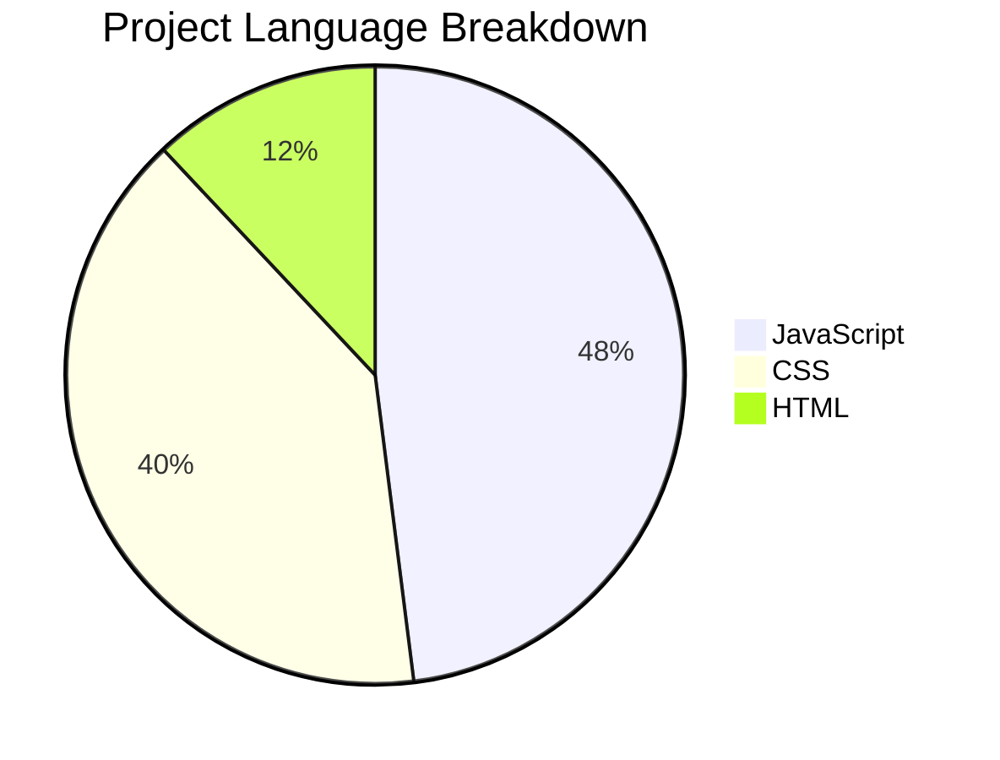

```markdown
# 🎬 X Stream & Play

> A self‑contained web video player with library management, HLS/DASH support, and real‑time performance stats.

[](https://opensource.org/licenses/MIT)
[](https://developer.mozilla.org/en-US/docs/Web/JavaScript)
[](https://github.com/video-dev/hls.js)


---

## Table of Contents

- [Overview](#overview)
- [Key Features](#key-features)
- [Tech Stack](#tech-stack)
- [Language Distribution](#language-distribution)
- [Folder Structure](#folder-structure)
- [Screenshots](#screenshots)
- [Getting Started](#getting-started)
- [Usage](#usage)
- [Configuration](#configuration)
- [FAQ](#faq)
- [Contributing](#contributing)
- [License](#license)
- [Author](#author)

---

## Overview

**X Stream & Play** is a pure front‑end video player that works entirely in your browser. Paste any direct video URL (MP4, MKV, WebM) or streaming manifest (HLS `.m3u8`, DASH `.mpd`) and start watching immediately. It includes a **local library** (persisted in `localStorage`), a custom control overlay, and a **Stats for Nerds** panel with real performance metrics.

Built with vanilla JavaScript, CSS variables, and the excellent [HLS.js](https://github.com/video-dev/hls.js) library, it’s designed for smooth adaptive‑bitrate playback across mobile and desktop.

---

## Key Features

- 📦 **Library Management** – Add videos by URL, auto‑extract titles, and store your list in the browser.
- ▶️ **Custom Controls** – Play/Pause, seek ±10s, volume, speed, PiP, fullscreen – all with a polished OTT‑style UI.
- 📊 **Stats for Nerds** – Live metrics: resolution, buffer health, dropped frames, HLS bitrate, network downlink, and more.
- 🎬 **Multi‑format Support** – HLS (`.m3u8`), DASH (`.mpd`), MP4, MKV, WebM, and other browser‑supported formats.
- 📱 **Mobile Optimised** – Double‑tap to seek, touch‑friendly controls, and responsive layout.
- ⌨️ **Keyboard Shortcuts** – Space (play/pause), arrow keys (seek), M (mute), F (fullscreen), I (stats toggle).
- 🌗 **Dark / Light Themes** – Toggle with a smooth transition; preference saved.
- ⚡ **Adaptive Bitrate** – HLS.js configured with sensible buffer and ABR settings for a smooth experience.

---

## Tech Stack


- **Pure vanilla JS** – no frameworks, no build tools.
- **HLS.js** – for HLS playback (loaded from CDN).
- **Google Fonts** – DM Sans, Bebas Neue, DM Serif Display, JetBrains Mono.
- **LocalStorage** – persistence for library and theme.

---

## Language Distribution



Language % Files
JavaScript 48% player.js, library.js, theme.js, hls-config.js
CSS 40% styles.css
HTML 12% index.html

---

Folder Structure

```
.
├── index.html          # Main HTML entry point
├── styles.css          # All styling (dark/light, responsive, custom controls)
├── player.js           # Video player logic, controls, HLS integration, stats
├── library.js          # Video library management, metadata fetching, persistence
├── theme.js            # Dark/light theme toggle with localStorage
├── hls-config.js       # HLS.js configuration object (exposed to window)
└── README.md           # This file
```

All files are at the root – no build step required.

---

Screenshots

Place your screenshots in the assets/ folder and link them below.

Library View Player Controls Stats Panel
assets/library.png assets/player.png assets/stats.png

If you don’t have assets, you can generate a demo GIF or use placeholder images.

---

Getting Started

Prerequisites

· A modern web browser (Chrome, Firefox, Edge, Safari).
· An HTTP server (optional – you can open index.html directly in some browsers, but CORS may restrict file:// for streaming).

Installation

1. Clone the repository:
   ```bash
   git clone https://github.com/yourusername/x-stream-play.git
   cd x-stream-play
   ```
2. Serve the files with any static server (e.g., Live Server for VS Code, or Python):
   ```bash
   python3 -m http.server 8000
   ```
   or
   ```bash
   npx serve
   ```
3. Open http://localhost:8000 (or your server address) in your browser.

Environment Variables

There are no environment variables – everything runs client‑side. You can tweak HLS settings directly in hls-config.js.

---

Usage

1. Add a video – paste any direct video URL (e.g., https://example.com/video.mp4) or streaming manifest (.m3u8, .mpd) into the input field and click Add.
2. Play – click on the video card in the library; it will load in the player and start playing (autoplay may be blocked by browsers until user interaction).
3. Controls:
   · Use the bottom bar for play/pause, seek, volume, speed, PiP, and fullscreen.
   · Double‑tap left/right side of the video to seek ±10s on mobile.
   · Keyboard shortcuts:
     · Space – Play/Pause
     · ← / → – Rewind / Forward 10s
     · ↑ / ↓ – Volume up / down
     · M – Mute
     · F – Fullscreen
     · I – Toggle Stats panel
4. Stats – click the Stats button (top‑right of the player) to see real‑time performance data.
5. Theme – click the moon/sun toggle in the header to switch between dark and light mode.

---

Configuration

HLS.js settings are exposed in hls-config.js. You can adjust parameters like:

· maxBufferLength – how many seconds of buffer to keep.
· abrBandWidthFactor – ABR aggressiveness.
· fragLoadingMaxRetry – retry attempts for fragment loading.

The file is loaded before HLS.js initialises, so changes take effect immediately.

---

FAQ

Q: What video formats are supported?
A: Any format the browser can play natively (MP4, WebM, MKV, etc.) plus HLS (.m3u8) via HLS.js and DASH (.mpd) using native video support (if the browser supports it).

Q: Does it work on mobile?
A: Yes – the player is responsive, supports touch events, and includes double‑tap seek.

Q: Where is my library stored?
A: In your browser's localStorage. It will persist across sessions on the same device.

Q: Can I use it offline?
A: No – because videos are streamed from external URLs. However, the library and theme settings are stored offline.

Q: Why isn't my HLS stream playing?
A: Check that the URL is accessible (CORS), and that HLS.js loaded correctly. You can enable debug: true in hls-config.js to see logs.

---

Contributing

Contributions are welcome! Please open an issue or submit a pull request. See CONTRIBUTING.md for guidelines.

---

License

This project is licensed under the MIT License – see the LICENSE file for details.

---

Author

𝐂𝐈𝐏𝐇𝐄𝐑 𝐗
Telegram • GitHub: @yourusername

---

Made with ❤️ for the streaming community.

```
